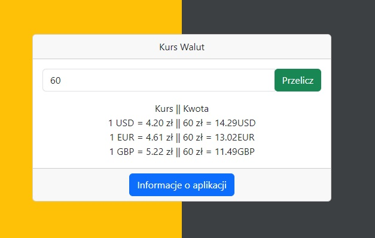

# :desktop_computer: ExchangeRate

The application displays the current exchange rate of the US dollar, euro, and pound, and then allows the user to convert a selected amount from Polish zloty to the chosen currency. The "Currencyfreak" API is used for the conversion.

## :framed_picture: Screenshots

## :joystick: Demo

https://kamilkeder.github.io/ExchangeRate/

## :e-mail: Feedback

If you have any feedback, please reach out to me at kontaktkkeder@gmail.com
